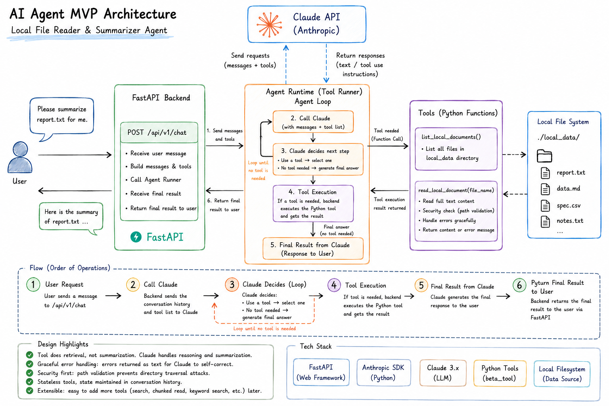
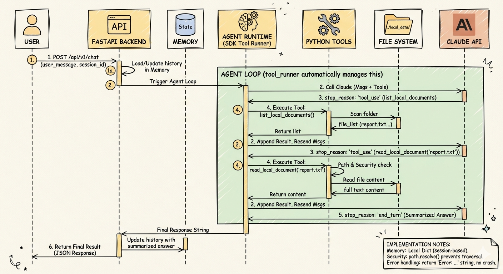
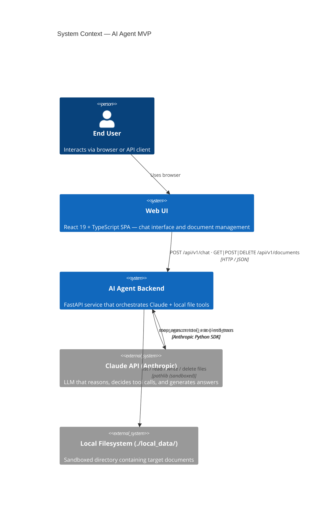
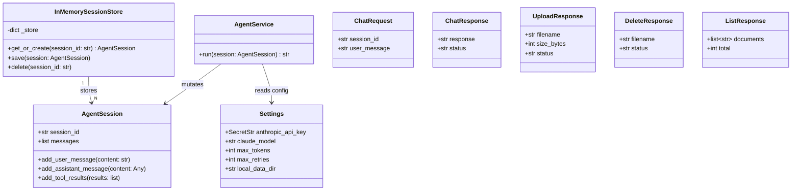

# AI Agent MVP — Local File Reader & Summarizer

> FastAPI · Anthropic Claude · React 19 · TypeScript · Python 3.12 · `uv`

A full-stack AI Agent that lets users upload, manage, and query local documents in natural language through a responsive web UI. Claude acts as the reasoning engine; Python tools handle all file I/O; React provides the chat interface.

---

## Architecture

### Visual Blueprints


*This diagram illustrates the high-level architecture of the AI Agent MVP. It highlights the flow from the user's natural language request to the FastAPI backend, which orchestrates the interaction with the Claude API. The diagram emphasizes the separation of concerns: the Agent Runtime manages the conversation loop, the Python tools are responsible for data retrieval from the local file system, and Claude handles the reasoning and summarization.*


*This sequence diagram details the chronological execution flow of the Agentic Loop. It demonstrates how the FastAPI backend acts as a bridge between the user and the LLM. When a tool call is required (e.g., to list or read files), the backend executes the local Python tool and feeds the result back to Claude. This recursive loop continues until Claude has sufficient context to generate the final summarized response.*

### C4 Context Diagram



### UML Class Diagram



### Agentic Loop Sequence

```
User ──POST /api/v1/chat──▶ FastAPI Handler
                                 │
                         Load / create AgentSession
                         Append user message
                                 │
                         AgentService.run(session)
                                 │
                    ┌────────────▼────────────┐
                    │     AGENT LOOP          │
                    │  Call Claude API        │◀────────────────┐
                    │  (messages + tools)     │                 │
                    └────────────┬────────────┘                 │
                                 │                               │
                    stop_reason == "tool_use"?                   │
                         │ Yes                                   │
                    Execute Python tool ─── result ─────────────┘
                         │ No (end_turn)
                    Extract final text
                    Persist to session
                                 │
                    FastAPI returns ChatResponse JSON ──▶ User
```

### Core Design Philosophy & Concept

1. **Separation of Concerns (Tools vs. LLM)**: Python tools are strictly responsible for data retrieval (reading the file system). The LLM (Claude) handles all reasoning, summarization, and decision-making. Tools *do not* summarize.
2. **The Agentic Loop**: The system utilizes a recursive loop. The backend intercepts Claude's tool requests (`stop_reason == "tool_use"`), executes the Python functions locally, and feeds the text results back to Claude. This continues until Claude has enough context to generate a final answer (`stop_reason == "end_turn"`).
3. **Defensive Design & Self-Correction**: Tools are designed to be fault-tolerant. Instead of raising exceptions (which would crash the loop), errors (like a missing file) are caught and returned as plain text (e.g., `"Error: File not found"`). This allows Claude to read the error and autonomously attempt to correct its parameters.
4. **Stateless Tools & State Management**: The tools and the Agent loop are inherently stateless. The conversational context (memory) is maintained entirely within the FastAPI in-memory session (`AgentSession`), keeping the architecture clean and horizontally scalable.

---

## Project Structure

```
ai-agent-mvp/
├── .env.example           # ← copy to .env and fill in your API key
├── .gitignore
├── pyproject.toml
├── local_data/            # sandboxed document directory
│   ├── sample_report.txt
│   └── getting_started.md
├── app/                   # FastAPI backend
│   ├── main.py            # FastAPI app factory + lifespan
│   ├── core/
│   │   └── config.py      # pydantic-settings (SecretStr for API key)
│   ├── domain/
│   │   ├── models.py      # AgentSession dataclass (zero external deps)
│   │   └── exceptions.py  # Typed error hierarchy
│   ├── api/v1/
│   │   ├── chat.py        # POST /api/v1/chat handler
│   │   └── documents.py   # GET|POST|DELETE /api/v1/documents handlers
│   ├── schemas/
│   │   ├── chat.py        # ChatRequest / ChatResponse Pydantic models
│   │   └── documents.py   # ListResponse / UploadResponse / DeleteResponse
│   └── services/
│       ├── agent.py       # AgentService — agentic loop
│       ├── memory.py      # InMemorySessionStore (swap to Redis later)
│       └── tools.py       # Tool definitions + registry (OCP-compliant)
└── web-ui/                # React 19 + TypeScript frontend
    ├── index.html
    ├── vite.config.ts     # Vite + Tailwind CSS v4 + /api proxy → :8000
    ├── package.json
    └── src/
        ├── main.tsx       # App entry, QueryClientProvider
        ├── App.tsx        # Root layout — responsive sidebar + chat
        ├── types/         # Shared TypeScript interfaces
        ├── api/           # Fetch wrappers for documents & chat endpoints
        ├── hooks/         # useDocuments (TanStack Query) · useChat (useState)
        └── components/
            ├── Sidebar/   # Document list, upload button, delete with confirm
            └── Chat/      # ChatArea, ChatMessage (markdown), MessageInput, TypingIndicator
```

---

## Quick Start

### Prerequisites
- Python 3.12+
- Node.js 20+
- [`uv`](https://docs.astral.sh/uv/) installed
- An Anthropic API key

### Backend setup

```bash
# 1. Enter the project
cd ai-agent-mvp

# 2. Install Python dependencies
uv sync

# 3. Configure environment
cp .env.example .env
# Edit .env and set ANTHROPIC_API_KEY=sk-ant-...

# 4. Run the backend server
uv run uvicorn app.main:app --reload --port 8000
```

### Frontend setup

```bash
# In a second terminal
cd ai-agent-mvp/web-ui
npm install
npm run dev          # opens at http://localhost:5173
```

The Vite dev server proxies all `/api` requests to `http://localhost:8000`, so no CORS configuration is needed.

### Try the API directly

```bash
# Health check
curl http://localhost:8000/health

# List uploaded documents
curl http://localhost:8000/api/v1/documents

# Upload a document
curl -X POST http://localhost:8000/api/v1/documents \
  -F "file=@local_data/sample_report.txt"

# Ask a question
curl -X POST http://localhost:8000/api/v1/chat \
  -H "Content-Type: application/json" \
  -d '{"session_id": "demo-1", "user_message": "What documents do you have?"}'

# Summarise a specific file
curl -X POST http://localhost:8000/api/v1/chat \
  -H "Content-Type: application/json" \
  -d '{"session_id": "demo-1", "user_message": "Please summarise sample_report.txt"}'

# Multi-turn follow-up (same session_id preserves history)
curl -X POST http://localhost:8000/api/v1/chat \
  -H "Content-Type: application/json" \
  -d '{"session_id": "demo-1", "user_message": "Which region exceeded its launch target and by how much?"}'
```

### Interactive API docs

Open [http://localhost:8000/docs](http://localhost:8000/docs) in your browser.

---

## API Reference

### `POST /api/v1/chat`

| Field | Type | Required | Description |
|-------|------|----------|-------------|
| `session_id` | string | ✅ | Unique conversation ID. Reuse across turns for multi-turn dialogue. |
| `user_message` | string | ✅ | Natural language prompt (1–8192 chars). |

**Response:**
```json
{ "response": "Claude's final answer...", "status": "success" }
```

---

### `GET /api/v1/documents`

Returns a sorted list of all documents in the `local_data/` directory.

**Response:**
```json
{ "documents": ["getting_started.md", "sample_report.txt"], "total": 2 }
```

---

### `POST /api/v1/documents`

Upload a new plain-text document (`.txt`, `.md`, `.csv`). Documents are **immutable** — uploading a file that already exists returns `409 Conflict`. Delete it first if a replacement is needed.

**Body:** `multipart/form-data` with a `file` field.

**Response `201`:**
```json
{ "filename": "report.txt", "size_bytes": 1024, "status": "uploaded" }
```

**Error codes:** `400` invalid filename · `409` already exists · `415` unsupported extension · `422` non-UTF-8 content

---

### `DELETE /api/v1/documents/{filename}`

Permanently remove a document from the store.

**Response `200`:**
```json
{ "filename": "report.txt", "status": "deleted" }
```

**Error codes:** `400` invalid filename · `404` not found

---

### `GET /health`
Liveness probe. Returns `{ "status": "ok", "env": "development" }`.

---

## Configuration (`.env`)

| Variable | Default | Description |
|----------|---------|-------------|
| `ANTHROPIC_API_KEY` | _(required)_ | Your Anthropic API key (`SecretStr` — never logged) |
| `ANTHROPIC_BASE_URL` | _(none)_ | Override for corporate LLM gateway / proxy |
| `CLAUDE_MODEL` | `claude-3-7-sonnet-20250219` | Model to use |
| `MAX_TOKENS` | `4096` | Max tokens in Claude's response |
| `MAX_RETRIES` | `2` | SDK-level retries on transient failures |
| `LOCAL_DATA_DIR` | `local_data` | Sandboxed document directory path |
| `APP_ENV` | `development` | Environment label |
| `DEBUG` | `false` | Enable DEBUG-level logging |

---

## Security

- **Directory Traversal Prevention**: `pathlib.Path.resolve()` is used in every tool to guarantee the resolved path stays within `local_data/`.  Any attempt to escape the sandbox (e.g., `../../../etc/passwd`) is blocked and logged.
- **Secrets Management**: The API key is a `pydantic.SecretStr` — it will not appear in logs, `repr()`, or JSON output.
- **Graceful Degradation**: Tools never raise exceptions.  Errors are returned as `"Error: ..."` strings so Claude can self-correct without crashing the loop.

---

## Adding a New Tool

1. Implement a function in `app/services/tools.py` that returns `str`.
2. Add its JSON schema to `TOOL_DEFINITIONS`.
3. Register it in `TOOL_REGISTRY`.

No other file needs to change (Open/Closed Principle).

---

## Out of Scope (Future Iterations)

- Persistent session storage (PostgreSQL / Redis)
- Vector database / semantic search (RAG)
- User authentication & authorization
- PDF / image / Word document parsing
- Streaming responses (SSE / WebSocket)
