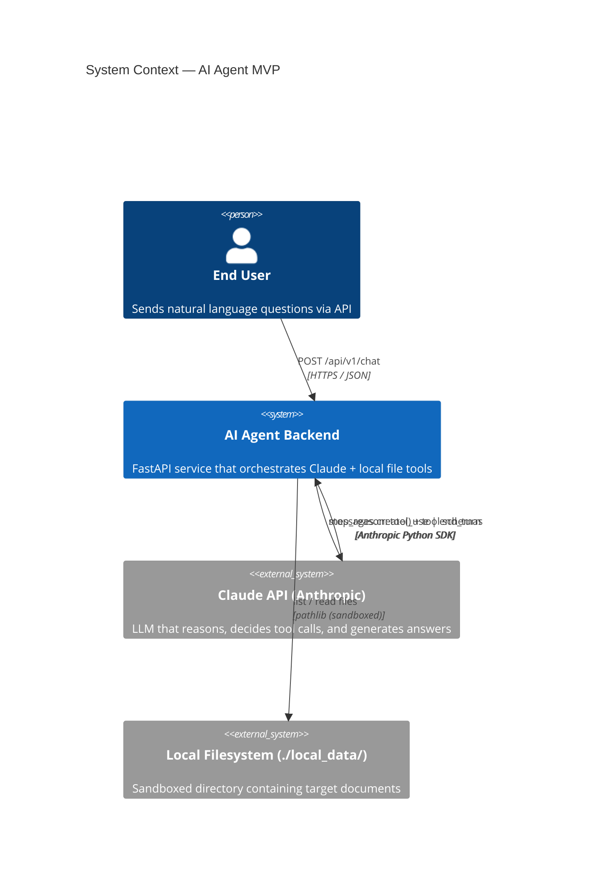
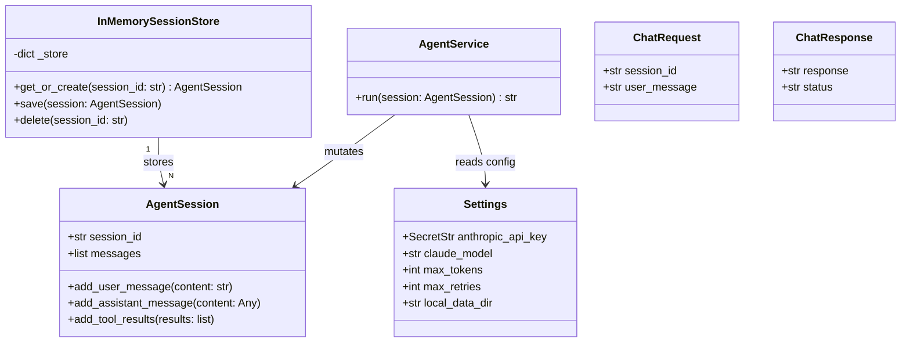

# AI Agent MVP — Local File Reader & Summarizer

> **MVP Phase 1** · FastAPI · Anthropic Claude · Python 3.12 · `uv`

A lightweight, production-quality AI Agent backend that lets users query and summarise local documents in natural language.  Claude acts as the reasoning engine; Python tools handle all file I/O.

---

## Architecture

### C4 Context Diagram



### UML Class Diagram



### Agentic Loop Sequence

```
User ──POST /api/v1/chat──▶ FastAPI Handler
                                 │
                         Load / create AgentSession
                         Append user message
                                 │
                         AgentService.run(session)
                                 │
                    ┌────────────▼────────────┐
                    │     AGENT LOOP          │
                    │  Call Claude API        │◀────────────────┐
                    │  (messages + tools)     │                 │
                    └────────────┬────────────┘                 │
                                 │                               │
                    stop_reason == "tool_use"?                   │
                         │ Yes                                   │
                    Execute Python tool ─── result ─────────────┘
                         │ No (end_turn)
                    Extract final text
                    Persist to session
                                 │
                    FastAPI returns ChatResponse JSON ──▶ User
```

---

## Project Structure

```
ai-agent-mvp/
├── .env.example           # ← copy to .env and fill in your API key
├── .gitignore
├── pyproject.toml
├── local_data/            # sandboxed document directory
│   ├── sample_report.txt
│   └── getting_started.md
└── app/
    ├── main.py            # FastAPI app factory + lifespan
    ├── core/
    │   └── config.py      # pydantic-settings (SecretStr for API key)
    ├── domain/
    │   ├── models.py      # AgentSession dataclass (zero external deps)
    │   └── exceptions.py  # Typed error hierarchy
    ├── api/v1/
    │   └── chat.py        # POST /api/v1/chat handler (thin, no business logic)
    ├── schemas/
    │   └── chat.py        # ChatRequest / ChatResponse Pydantic models
    └── services/
        ├── agent.py       # AgentService — agentic loop
        ├── memory.py      # InMemorySessionStore (swap to Redis later)
        └── tools.py       # Tool definitions + registry (OCP-compliant)
```

---

## Quick Start

### Prerequisites
- Python 3.12+
- [`uv`](https://docs.astral.sh/uv/) installed
- An Anthropic API key

### Setup

```bash
# 1. Clone and enter the project
cd ai-agent-mvp

# 2. Install dependencies with uv
uv sync

# 3. Configure environment
cp .env.example .env
# Edit .env and set ANTHROPIC_API_KEY=sk-ant-...

# 4. Run the server
uv run uvicorn app.main:app --reload --port 8000
```

### Try it out

```bash
# Health check
curl http://localhost:8000/health

# Discover available documents
curl -X POST http://localhost:8000/api/v1/chat \
  -H "Content-Type: application/json" \
  -d '{"session_id": "demo-1", "user_message": "What documents do you have?"}'

# Summarise a specific file
curl -X POST http://localhost:8000/api/v1/chat \
  -H "Content-Type: application/json" \
  -d '{"session_id": "demo-1", "user_message": "Please summarise sample_report.txt"}'

# Multi-turn follow-up (same session_id preserves history)
curl -X POST http://localhost:8000/api/v1/chat \
  -H "Content-Type: application/json" \
  -d '{"session_id": "demo-1", "user_message": "Which region exceeded its launch target and by how much?"}'
```

### Interactive API docs

Open [http://localhost:8000/docs](http://localhost:8000/docs) in your browser.

---

## API Reference

### `POST /api/v1/chat`

| Field | Type | Required | Description |
|-------|------|----------|-------------|
| `session_id` | string | ✅ | Unique conversation ID. Reuse across turns for multi-turn dialogue. |
| `user_message` | string | ✅ | Natural language prompt (1–8192 chars). |

**Response:**
```json
{ "response": "Claude's final answer...", "status": "success" }
```

### `GET /health`
Liveness probe. Returns `{ "status": "ok", "env": "development" }`.

---

## Configuration (`.env`)

| Variable | Default | Description |
|----------|---------|-------------|
| `ANTHROPIC_API_KEY` | _(required)_ | Your Anthropic API key (`SecretStr` — never logged) |
| `ANTHROPIC_BASE_URL` | _(none)_ | Override for corporate LLM gateway / proxy |
| `CLAUDE_MODEL` | `claude-3-7-sonnet-20250219` | Model to use |
| `MAX_TOKENS` | `4096` | Max tokens in Claude's response |
| `MAX_RETRIES` | `2` | SDK-level retries on transient failures |
| `LOCAL_DATA_DIR` | `local_data` | Sandboxed document directory path |
| `APP_ENV` | `development` | Environment label |
| `DEBUG` | `false` | Enable DEBUG-level logging |

---

## Security

- **Directory Traversal Prevention**: `pathlib.Path.resolve()` is used in every tool to guarantee the resolved path stays within `local_data/`.  Any attempt to escape the sandbox (e.g., `../../../etc/passwd`) is blocked and logged.
- **Secrets Management**: The API key is a `pydantic.SecretStr` — it will not appear in logs, `repr()`, or JSON output.
- **Graceful Degradation**: Tools never raise exceptions.  Errors are returned as `"Error: ..."` strings so Claude can self-correct without crashing the loop.

---

## Adding a New Tool

1. Implement a function in `app/services/tools.py` that returns `str`.
2. Add its JSON schema to `TOOL_DEFINITIONS`.
3. Register it in `TOOL_REGISTRY`.

No other file needs to change (Open/Closed Principle).

---

## Out of Scope (Future Iterations)

- Persistent session storage (PostgreSQL / Redis)
- Vector database / semantic search (RAG)
- User authentication & authorization
- PDF / image / Word document parsing
- Streaming responses (SSE / WebSocket)
- Frontend UI
